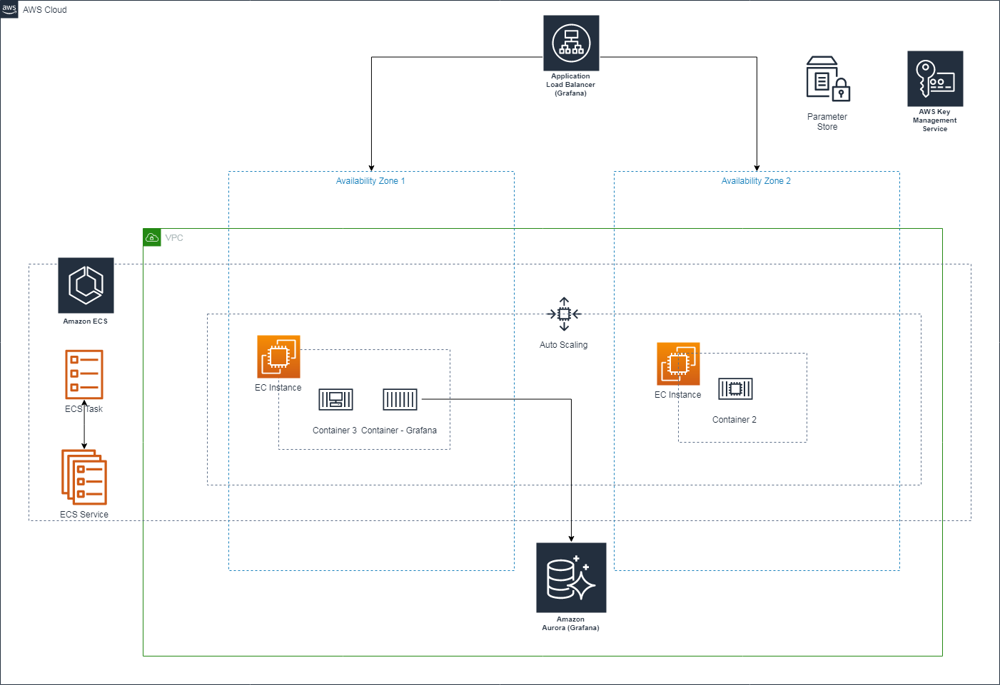

# AWS Config Compliance information in Dashoard using AWS Elastic Search and Kibana (Work in progress)

Visualize AWS Config Compliance information in Dashoard using AWS Elastic Search and Kibana.


## What resources are created

1. VPC
2. Internet Gateway (IGW)
3. Public and Private Subnets
4. Security Groups, Route Tables and Route Table Associations
5. IAM roles, instance profiles and policies
6. Amazon EC2 Container Service ( On EC2 )
7. Grafana container service on ECS.
9. Amazon Aurora Serverless ( for high availibilty )

----

## How to use this example

## Pre-resuisite

1. Python v3.7
2. Terraform v0.11.14
3. AWS Account
4. IAM User With Admin Access


```bash
git clone git@github.com:nitinda/terraform_grafana_on_ecs.git
cd terraform_grafana_on_ecs
make plan
make apply
```


## Manual Steps post deployment (Optional)

```
- Deployed Lambda function (i.e. terraform-demo-lambda-wiringfunction) needs to be executed before accessing the kibana
    - Create test evnet, this function will create Cognito user (i.e. - kibana default password : Abcd1234!)
```

----

## Diagram




----

## Cleaning up

You can destroy this cluster entirely by running:

```bash
git clone git@github.com:nitinda/terraform_grafana_on_ecs.git
cd terraform_grafana_on_ecs
make plan
make destroy
```